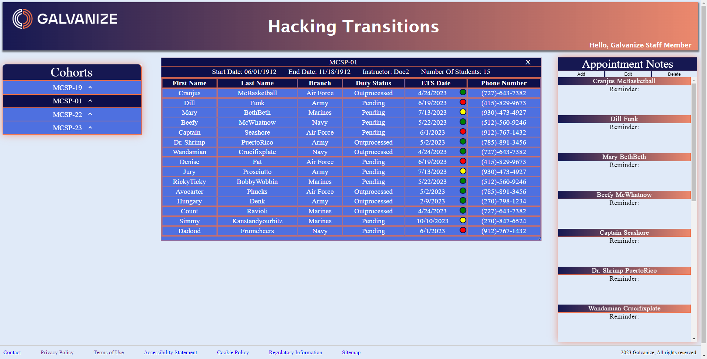

# Hacking Transitions

## Description
A Full-Stack React application for transition managers to keep track of students, and their appointments. The application stores information in a database for multiple cohorts, who each have multiple students. Information attributed to the students includes Full name, Branch, Duty status, ETS date (with corresponding color indicator depending on the time to ETS), and their phone numbers. The application  provides the ability to add/edit/delete appointment notes on the fly for each individual student. The application requires users to register using email credentials, and provide a password for access to sensitive information. The user's password is hashed with additional 10 salt rounds, and is one-way encrypted so it can be stored in the database, and attributed to each individual user.

## Table of Contents
* [Technologies](#technologies)
* [Installation](#installation)
* [Usage](#usage)
* [Screenshot](#screenshot)
* [Contributors](#contributors)
* [Tests](#tests)
* [Questions](#questions)
* [License](#license) 

## Technologies

- [`react`](https://react.dev) - Library for web and native user interfaces.
- [`vite`](https://vitejs.dev/) - Module bundler, transpiler and dev server.
- [`express`](https://expressjs.com)  - Framework with a robust set of features for web and mobile applications.
- [`postgres`](https://postgresql.org) - Powerful, open source object-relational database system.
- [`cypress`](https://cypress.io/) - E2E Test suite.
- [`vitest`](https://vitest.dev/) - Unit test runner.
- [`react-testing-library`](https://testing-library.com/docs/react-testing-library/api/) - React component test helper.
- [`react-auth-kit`](https://authkit.arkadip.dev/) - User registration, and authentication.
- [`bcrypt`](https://www.npmjs.com/package/bcrypt) - A library to help you hash passwords.
- [`JSON web tokens`](https://jwt.io/) - Open, industry standard RFC 7519 method for representing claims securely between two parties.
- [`docker`](https://www.docker.com/) - Containerization framework for dev and deployment.
- [`heroku`](https://www.heroku.com) - Cloud application platform.

## Installation
1. This application builds the development environment inside Docker, so after forking/cloning, make sure you have Docker desktop running.
2. In your terminal run `cp .env.example .env; cp api/.env.example api/.env` - Copy required environment variables.
3. In your terminal run `npm install; npm install --prefix=api; npm install --prefix=client` - Install all dependencies.
4. In your terminal run `docker compose up --build` - From the root directory (Note* the --build command ensures dependencies are installed alongside the Docker container build).
5. Visit deployed application @ https://hacking-transitions.herokuapp.com.
6. *Note: Since the database for the deployed application is hosted on Heroku, any changes to the data, or structure of the ERD must be pushed to heroku manually by using Heroku's CLI and adding/removing/altering the data from there. Updating the included migration and seed files will not affect the deployed version.

## Usage
For Staff Members charged with assisting students as they transition from military service.

## Screenshot

## Contributors
Matthew Drevon (Software Engineer) || Josh Benton (User Interface Owner) || Will Franceschini(Architectural Owner) || Blake Barkman (Project Manager) || Dennis Kennedy (Software Engineer) || Kimberly Jenkins (Software Engineer)

## Tests
Full E2E test suite with Cypress, Multiple unit tests written for various components throughout the entire application with Vitest & react-test-library, and development testing with Postman during API development to test routes.

## Questions
Contact information (GitHub usernames) of the developers:
Burman - burman92 || Steve - EZSteezy || Kevin - kevin-foreman || Brennan - Alphie1028 || Josh - Velkore || Todd - todd-j-topicz 

## License
The license used for this project is MIT.
For more information visit: https://opensource.org/license/mit/
